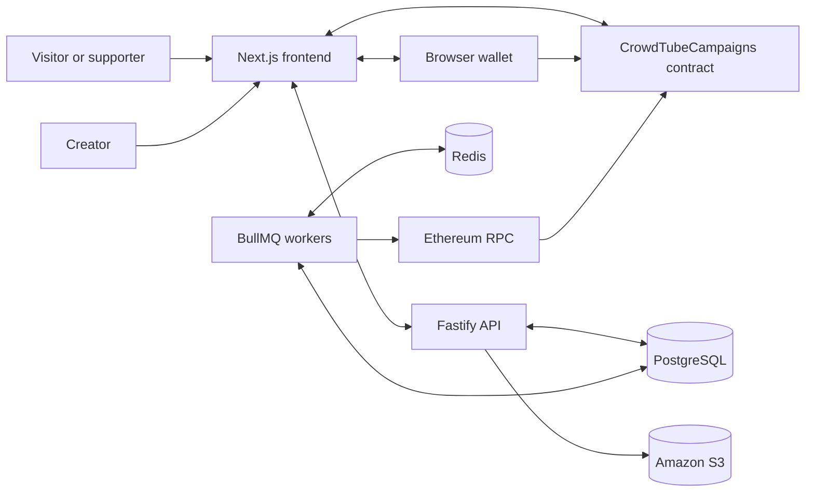

# CrowdTube

CrowdTube is a Web3 crowdfunding platform for YouTube creators. Creators publish campaigns, supporters donate ETH directly through their wallets, and the application indexes blockchain events to provide notifications, donation history, and analytics.

The current MVP targets a local Hardhat network for development and Ethereum Sepolia for public testing. It is an educational project and has not been audited for mainnet use.

## Main features

- Wallet-based authentication without passwords.
- Creator profile and campaign management.
- Campaign creation backed by a Solidity smart contract.
- Public campaign discovery and donation pages.
- Direct ETH donations and creator withdrawals.
- Fast transaction-receipt confirmation with worker-based reconciliation.
- Donation notifications, paginated history, and creator analytics.
- Portuguese and English user interfaces.

## Architecture at a glance



The smart contract is the source of truth for campaign ownership and financial state. PostgreSQL stores profiles, off-chain campaign metadata, authentication sessions, and indexed projections of blockchain events.

## Technology stack

| Area | Main technologies |
| --- | --- |
| Frontend | Next.js 16, React 19, TypeScript, Tailwind CSS, thirdweb |
| Backend | Node.js, Fastify, TypeScript, TypeORM, Viem |
| Workers | BullMQ, Redis, Viem |
| Database | PostgreSQL 16 |
| Media | Amazon S3 presigned URLs |
| Smart contracts | Solidity 0.8.34, Hardhat 3, Ignition |
| Networks | Hardhat local network and Ethereum Sepolia |

## Repository layout

```text
CrowdTube/
├── backend/     Fastify API, PostgreSQL persistence, and event workers
├── frontend/    Next.js application and wallet interactions
├── web3/        Solidity contracts, tests, and Ignition deployments
├── docs/        Architecture, setup, deployment, and flow documentation
└── PRD.md       Original product requirements document
```

See [Project structure](docs/project-structure.md) for a detailed directory guide.

## Quick start

The complete procedure is available in [Local development](docs/getting-started.md). The short version is:

1. Install dependencies in `backend`, `frontend`, and `web3` with `npm ci`.
2. Start PostgreSQL and Redis from `backend` with `npm run infra:up`.
3. Start a local chain from `web3` with `npm run node`.
4. Deploy `CrowdTubeCampaigns` with `npm run deploy:campaigns:localhost`.
5. Configure the backend and frontend `.env` files with the deployed address.
6. Run backend migrations with `npm run migration:run`.
7. Start the API, workers, and frontend in separate terminals.

When running locally, the main endpoints are:

- Frontend: <http://localhost:3000>
- Public campaigns: <http://localhost:3000/campaigns>
- API: <http://localhost:3333>
- Swagger UI: <http://localhost:3333/docs>
- Health check: <http://localhost:3333/health>

## Documentation

- [Local development](docs/getting-started.md)
- [Project structure](docs/project-structure.md)
- [Architecture](docs/architecture.md)
- [Configuration reference](docs/configuration.md)
- [Deployment](docs/deployment.md)
- [Database](docs/database.md)
- [Smart contracts and Web3](docs/web3.md)
- [Wallet authentication flow](docs/flows/authentication.md)
- [Campaign creation flow](docs/flows/campaign-creation.md)
- [Campaign indexer flow](docs/flows/campaign-indexing.md)
- [Donation flow](docs/flows/donation.md)
- [Donation indexer flow](docs/flows/donation-indexing.md)
- [Withdrawal flow](docs/flows/withdrawal.md)
- [Analytics flow](docs/flows/analytics.md)

## Useful commands

Run commands from the corresponding module directory.

| Module | Command | Purpose |
| --- | --- | --- |
| Frontend | `npm run dev` | Start Next.js in development mode |
| Frontend | `npm run build` | Create a production build |
| Frontend | `npm run lint` | Run ESLint |
| Backend | `npm run dev` | Start the API with file watching |
| Backend | `npm run worker:dev` | Start campaign and donation workers |
| Backend | `npm run infra:up` | Start PostgreSQL and Redis |
| Backend | `npm run migration:run` | Apply pending database migrations |
| Backend | `npm test` | Compile and run the backend test suite |
| Web3 | `npm run node` | Start a persistent local Hardhat chain |
| Web3 | `npm run deploy:campaigns:localhost` | Deploy the main contract locally |
| Web3 | `npm run deploy:campaigns:sepolia` | Deploy the main contract to Sepolia |
| Web3 | `npm test` | Run smart-contract tests |

## Security notice

- Never place wallet private keys in the frontend or backend environment files.
- `SEPOLIA_PRIVATE_KEY` is used only by Hardhat to deploy contracts.
- Contract addresses and Ignition deployment records are public information and may be committed.
- Do not reuse a mainnet wallet or fund a development wallet with real assets.
- The contracts must be independently reviewed before any mainnet deployment.

