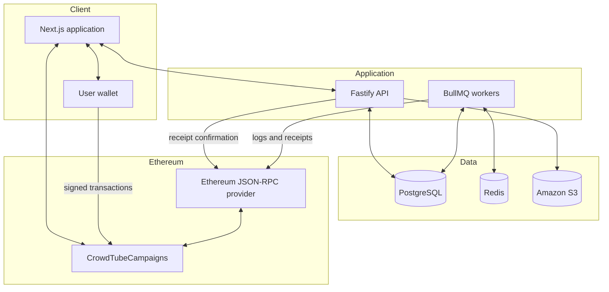
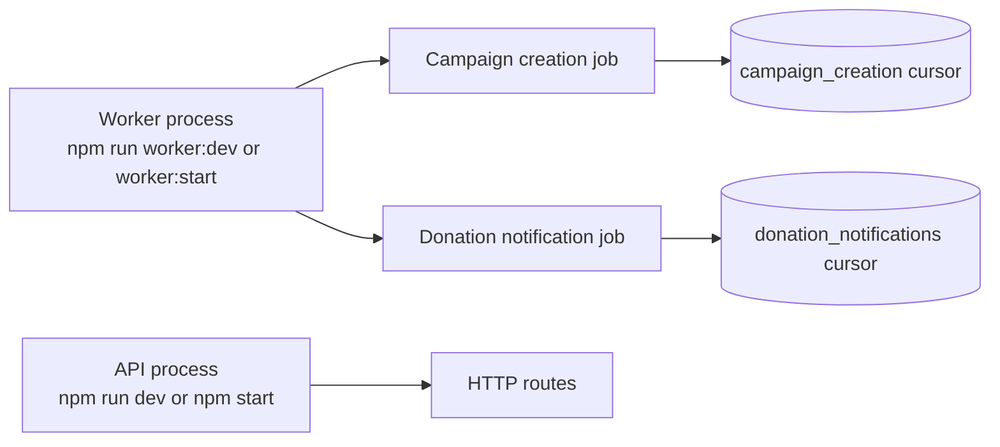
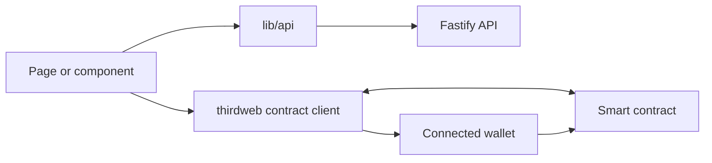

# Architecture

CrowdTube combines direct wallet-to-contract transactions with an off-chain application layer. The design avoids custodial handling: the backend never receives or signs a user's donation or withdrawal transaction.

## System context

## Sources of truth

| Information | Source of truth | Off-chain representation |
| --- | --- | --- |
| Campaign creator | Smart contract | Indexed campaign reference |
| Goal and deadline | Smart contract | Read directly by the frontend |
| Total raised and withdrawn | Smart contract | Donation events support history and analytics |
| Campaign active status | Smart contract | Read directly by the frontend |
| Title, description, category, YouTube URL | PostgreSQL | `campaigns` table |
| Profile and linked wallets | PostgreSQL | `users` and `user_wallets` |
| Authentication session | PostgreSQL | Hashed session token and HttpOnly cookie |
| Donation history | Blockchain event | Idempotent row in `donation_events` |
| Creator notification | PostgreSQL projection | `notifications` table |
| Images | Amazon S3 | Persistent object key in PostgreSQL |

If an indexed financial projection disagrees with the contract, the contract state wins.

## Runtime processes

CrowdTube uses separate processes so HTTP traffic and historical blockchain synchronization do not block one another.

The two indexers have independent durable cursors. A failure in donation processing does not move or corrupt the campaign-creation cursor.

## Backend layers

The backend uses explicit dependency composition in `src/container.ts`.

1. **Routes** declare HTTP methods, paths, schemas, and authentication guards.
2. **Controllers** normalize application responses and errors for Fastify.
3. **Adapters** validate and translate external input into use-case input.
4. **Use cases** implement application rules without depending on Fastify.
5. **Repositories and gateways** describe persistence and infrastructure capabilities.
6. **TypeORM, Viem, AWS, Redis, and crypto implementations** perform external I/O.

This separation makes core behavior testable without an active database, RPC provider, or S3 bucket.

## Frontend data paths

The frontend deliberately uses two access paths:

- HTTP API calls retrieve profiles, campaign metadata, authentication state, histories, notifications, and analytics.
- Thirdweb reads and writes financial contract state through the user's selected chain and wallet.

Contract writes always require user approval in the wallet. Backend cookies cannot authorize blockchain transfers.

## Consistency model

Blockchain writes and PostgreSQL writes cannot share a database transaction. CrowdTube handles this with recoverable states and idempotent reconciliation:

- A campaign begins as an off-chain `draft`.
- After the wallet sends the transaction, the transaction hash is stored and the campaign becomes `pending_onchain`.
- The worker validates the receipt/event before marking it `published`.
- If the transaction-hash API call fails, the worker can still match the `CampaignCreated` event by `metadataId`.
- A confirmed donation is sent to the API by transaction hash for low latency.
- The donation worker scans logs as a fallback and catches events missed while any process was offline.
- Unique blockchain source keys make repeated processing safe.

## Security boundaries

- The user's wallet owns and signs campaign, donation, status, and withdrawal transactions.
- The backend stores only hashed session tokens; the raw token exists in an HttpOnly cookie.
- The worker uses read-only RPC access and does not need a wallet private key.
- The frontend contains public configuration only. Any value prefixed with `NEXT_PUBLIC_` is visible to users.
- The Sepolia deployer private key belongs only in the Hardhat execution environment.

