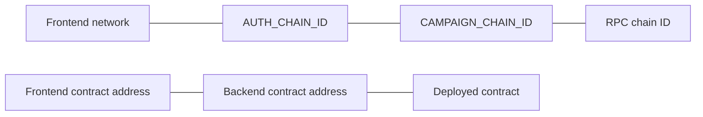

# Configuration reference

CrowdTube has separate environment files for the backend and frontend. Hardhat deployment secrets are supplied to the deployment process itself.

## Backend environment

Start from `backend/.env.example` and save the local values in `backend/.env`.

### Application and database

| Variable | Required | Default/example | Description |
| --- | --- | --- | --- |
| `NODE_ENV` | No | `dev` | One of `dev`, `test`, or `prd` |
| `HOST` | No | `0.0.0.0` | API listen address |
| `PORT` | No | `3333` | API listen port |
| `DB_HOST` | Yes | `localhost` | PostgreSQL host |
| `DB_PORT` | No | `5432` | PostgreSQL port |
| `DB_USER` | Yes | `postgres` | PostgreSQL user |
| `DB_PASSWORD` | Yes | `postgres` | PostgreSQL password |
| `DB_NAME` | Yes | `crowdtube` | PostgreSQL database |
| `FRONTEND_ORIGIN` | No | `http://localhost:3000` | Exact browser origin allowed by CORS |

### Wallet authentication

| Variable | Required | Default/example | Description |
| --- | --- | --- | --- |
| `AUTH_DOMAIN` | No | `localhost:3000` | Domain included in the signed login message |
| `AUTH_URI` | No | `http://localhost:3000` | URI included in the signed login message |
| `AUTH_CHAIN_ID` | No | `31337` | Expected chain in the login message |
| `AUTH_NONCE_TTL_SECONDS` | No | `300` | Login challenge lifetime |
| `AUTH_SESSION_TTL_SECONDS` | No | `604800` | Session lifetime; example is seven days |
| `AUTH_SESSION_COOKIE_NAME` | No | `crowdtube_session` | HttpOnly cookie name |

`AUTH_CHAIN_ID` must match the chain configured in the frontend. A mismatch is rejected before the user signs the challenge.

### Amazon S3 media

| Variable | Required | Default/example | Description |
| --- | --- | --- | --- |
| `AWS_REGION` | Yes | `us-east-1` | S3 bucket region |
| `AWS_S3_BUCKET_NAME` | Yes | `crowdtube-media` | Private media bucket |
| `AWS_S3_UPLOAD_URL_TTL_SECONDS` | No | `300` | Presigned upload URL lifetime, maximum 3600 |
| `AWS_S3_READ_URL_TTL_SECONDS` | No | `300` | Presigned read URL lifetime, maximum 3600 |
| `AWS_ACCESS_KEY_ID` | For S3 access | — | Read by the AWS SDK credential chain |
| `AWS_SECRET_ACCESS_KEY` | For S3 access | — | Read by the AWS SDK credential chain |

The API creates presigned URLs. Image bytes travel directly between the browser and S3.

### Workers and blockchain readers

| Variable | Required for workers | Default/example | Description |
| --- | --- | --- | --- |
| `REDIS_URL` | Yes | `redis://localhost:6379` | BullMQ connection |
| `CAMPAIGN_RPC_URL` | Yes | `http://127.0.0.1:8545` | JSON-RPC endpoint used by the API receipt path and workers |
| `CAMPAIGN_CHAIN_ID` | Yes | `31337` | Expected RPC chain ID |
| `CAMPAIGN_CONTRACT_ADDRESS` | Yes | `0x...` | Deployed `CrowdTubeCampaigns` address |
| `CAMPAIGN_DEPLOY_BLOCK` | Yes | `0` locally | First block that may contain contract events |
| `CAMPAIGN_CONFIRMATIONS` | No | `1` | Required confirmations before processing |
| `CAMPAIGN_LOG_BATCH_SIZE` | No | `500` | Maximum `eth_getLogs` block range |
| `CAMPAIGN_MAX_HISTORICAL_BATCHES_PER_RUN` | No | `10` | Catch-up batches processed by one scheduled run |
| `CAMPAIGN_INDEXER_POLL_MS` | No | `10000` | Campaign indexer interval; minimum 1000 ms |
| `DONATION_NOTIFICATION_POLL_MS` | No | `10000` | Donation indexer interval; minimum 1000 ms |

Use a small `CAMPAIGN_LOG_BATCH_SIZE` when the RPC plan limits `eth_getLogs` ranges. For example, set it to `5` when the provider allows only five blocks per request.

`CAMPAIGN_DEPLOY_BLOCK` is the block containing the contract deployment transaction, not a campaign creation block. Starting there prevents the indexer from scanning blocks that cannot contain events from this contract.

## Frontend environment

Start from `frontend/.env.example` and save values in `frontend/.env`.

| Variable | Required | Example | Description |
| --- | --- | --- | --- |
| `NEXT_PUBLIC_THIRDWEB_CLIENT_ID` | Yes | Thirdweb client ID | Initializes wallet and RPC services |
| `NEXT_PUBLIC_WEB3_NETWORK` | Yes | `hardhat` or `sepolia` | Selects the frontend chain definition |
| `NEXT_PUBLIC_CROWDTUBE_CAMPAIGNS_ADDRESS` | Yes | `0x...` | Contract address on the selected network |
| `NEXT_PUBLIC_API_URL` | Yes | `http://localhost:3333` | Backend base URL |

All frontend variables are public by design. Never put a private key, AWS secret, database password, or privileged RPC credential in them.

The local Hardhat chain RPC is defined in source as `http://127.0.0.1:8545`. Sepolia uses the thirdweb chain configuration.

## Hardhat deployment environment

The Sepolia network reads these values through Hardhat configuration variables:

| Variable | Required for Sepolia deploy | Description |
| --- | --- | --- |
| `SEPOLIA_RPC_URL` | Yes | RPC endpoint that supports transaction submission |
| `SEPOLIA_PRIVATE_KEY` | Yes | Private key of the deployer wallet |

These values are needed only while running the Hardhat deployment. Application users connect and sign with their own wallets; the API and worker do not need the deployer key.

## Values that must agree

A mismatch produces authentication failures, missing contract bytecode, missing events, or transactions sent to the wrong deployment.

## Secret handling

- Keep `.env` files untracked; only `.env.example` belongs in Git.
- Prefer platform secret managers in production.
- Rotate a key immediately if it is committed accidentally.
- Contract addresses, chain IDs, deployment blocks, and transaction hashes are public and are not secrets.
- Ignition deployment records contain public deployment data and may be committed for persistent networks.

