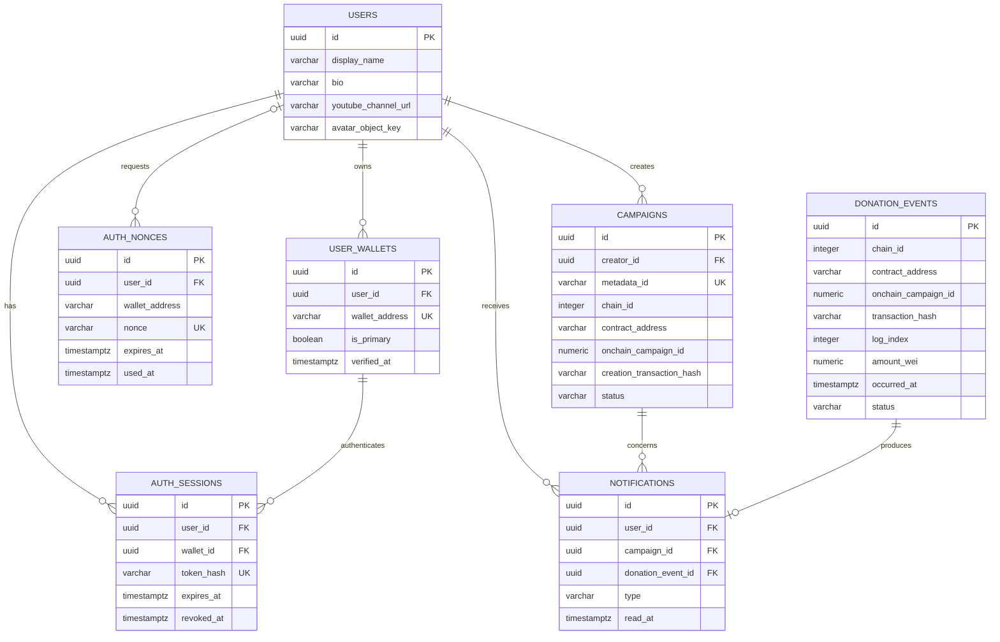
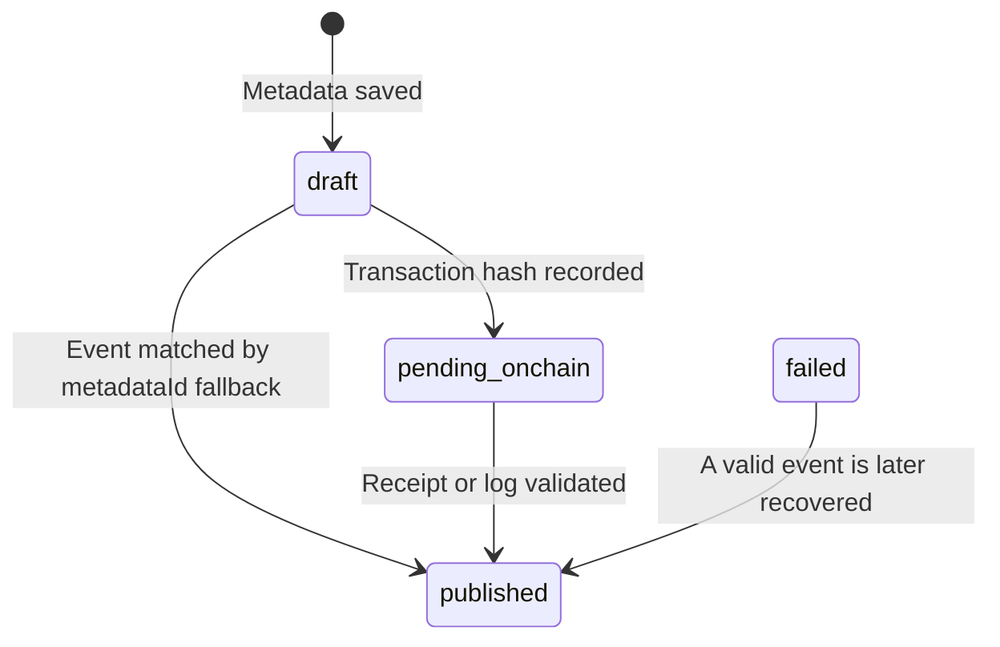

# Database

PostgreSQL stores off-chain product data and indexed blockchain projections. TypeORM maps domain entities to the schema, while explicit migrations control schema changes.

## Data model



`chain_sync_state` is intentionally independent of product entities. Its composite key is `chain_id + contract_address + stream_name`, allowing each indexer stream to maintain its own durable block cursor.

## Table responsibilities

| Table | Responsibility |
| --- | --- |
| `users` | Creator profile data |
| `user_wallets` | Verified wallet-to-user associations |
| `auth_nonces` | Expiring, single-use wallet signature challenges |
| `auth_sessions` | Hashed session tokens and revocation state |
| `campaigns` | Off-chain metadata and association with an on-chain campaign |
| `chain_sync_state` | Last historically processed block per indexer stream |
| `donation_events` | Idempotent projection of `DonationReceived` logs |
| `notifications` | Creator-facing projection for matched donation events |

## Campaign states



The current UI and indexer primarily use `draft`, `pending_onchain`, and `published`. The `failed` value is reserved in the domain and can still be recovered by a valid event, but the current workflow does not automatically assign it. A published campaign has a complete chain ID, contract address, and on-chain campaign ID.

## Blockchain idempotency

Donation events are unique by:

```text
chain_id + contract_address + transaction_hash + log_index
```

The API receipt path and the worker may discover the same event. Both use insert-if-absent behavior, so one blockchain log creates at most one `donation_events` row and one notification.

Campaign on-chain references are unique by:

```text
chain_id + contract_address + onchain_campaign_id
```

These constraints make retries and worker restarts safe.

## Time and financial values

- Wei values use `numeric(78, 0)` and are returned by the API as decimal strings.
- Block numbers and on-chain campaign IDs also use wide numeric columns.
- The frontend converts strings to `bigint`; it does not use floating-point arithmetic for ETH.
- `donation_events.occurred_at` comes from the blockchain block timestamp.
- Analytics groups days in UTC and uses a half-open period: `from <= occurred_at < to`.

## Analytics projection

Analytics joins `notifications`, `donation_events`, and `campaigns`. Only processed donation events associated with a creator campaign are included.

The API computes:

- All-time gross amount.
- Amount, count, and integer average for a selected period.
- A zero-filled daily UTC timeline.
- Per-campaign all-time and period totals.

Withdrawals do not reduce the gross raised analytics value. Available balances are read from the contract instead.

## Migrations

Apply pending migrations:

```bash
cd backend
npm run migration:run
```

Revert the most recently applied migration:

```bash
npm run migration:revert
```

Reversion is a potentially destructive operational action. Review the migration and back up production data first.

When adding a schema change:

1. Create a timestamped migration in `backend/src/database/migrations`.
2. Register it in `backend/src/database/typeorm-data-source.ts`.
3. Update the related TypeORM entity schema.
4. Add or update repository and use-case tests.
5. Verify `migration:run` against a disposable database.

TypeORM `synchronize` is disabled in every environment.

## Backup and recovery

For a persistent deployment:

- Enable automated PostgreSQL backups and point-in-time recovery.
- Back up before migrations.
- Monitor storage, connections, and slow queries.
- Preserve `chain_sync_state`; deleting it causes historical replay.
- Historical replay is safe because event inserts are idempotent, but it increases RPC and database load.

