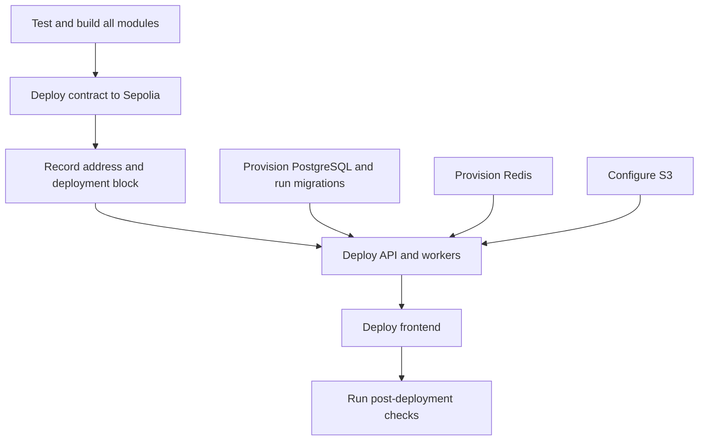

# Deployment

This guide covers the current Sepolia-oriented deployment model. Hosting providers are intentionally not prescribed; the frontend, API, workers, PostgreSQL, Redis, and S3 may be deployed on any compatible platform.

## Deployment order



## 1. Pre-deployment checks

Run these commands from their module directories:

```bash
# web3
npm ci
npm test
npm run build

# backend
npm ci
npm test
npm run lint
npm run build

# frontend
npm ci
npm run lint
npm run build
```

Deploy only from a reviewed commit with a clean working tree.

## 2. Deploy the contract to Sepolia

The deployment account pays gas only for contract deployment. CrowdTube users always sign their own transactions.

The recommended local setup stores the values in Hardhat's encrypted keystore. Run these commands from `web3` and enter the values only when prompted:

```bash
npx hardhat keystore set SEPOLIA_RPC_URL
npx hardhat keystore set SEPOLIA_PRIVATE_KEY
```

Use a CI secret store instead when deploying from an automated pipeline. See [Hardhat deployment environment](configuration.md#hardhat-deployment-environment) for the variable formats, temporary shell alternative, and security guidance.

Then run:

```bash
cd web3
npm run deploy:campaigns:sepolia
```

Hardhat uses the production compiler profile with the Solidity optimizer enabled.

After deployment, save:

- The contract address from `web3/ignition/deployments/chain-11155111/deployed_addresses.json`.
- The deployment transaction hash.
- The deployment receipt block number as `CAMPAIGN_DEPLOY_BLOCK`.

The block number can be read from the transaction on a Sepolia explorer, from `eth_getTransactionReceipt`, or from the Ignition deployment journal. It is public configuration, not a secret.

Ignition deployment files for Sepolia should remain versioned. They allow Hardhat to understand and resume the public deployment state.

## 3. Provision application infrastructure

The backend requires:

- PostgreSQL.
- Redis with a `noeviction`-compatible policy for BullMQ reliability.
- An S3 bucket.
- A Sepolia RPC endpoint readable by the API and workers.

The API and worker can use the same compiled backend artifact but must run as separate processes:

```bash
npm run start
npm run worker:start
```

Run at least one API instance and one worker instance. BullMQ global concurrency prevents two active workers from processing the same chain stream simultaneously.

## 4. Configure production backend values

At minimum, update:

```dotenv
NODE_ENV=prd
HOST=0.0.0.0
PORT=3333

DB_HOST=<POSTGRES_HOST>
DB_PORT=5432
DB_USER=<POSTGRES_USER>
DB_PASSWORD=<POSTGRES_PASSWORD>
DB_NAME=<POSTGRES_DATABASE>

FRONTEND_ORIGIN=https://<FRONTEND_HOST>
AUTH_DOMAIN=<FRONTEND_HOST>
AUTH_URI=https://<FRONTEND_HOST>
AUTH_CHAIN_ID=11155111

REDIS_URL=<REDIS_OR_REDISS_URL>
CAMPAIGN_RPC_URL=<SEPOLIA_RPC_ENDPOINT>
CAMPAIGN_CHAIN_ID=11155111
CAMPAIGN_CONTRACT_ADDRESS=<DEPLOYED_ADDRESS>
CAMPAIGN_DEPLOY_BLOCK=<DEPLOYMENT_BLOCK>
CAMPAIGN_CONFIRMATIONS=<REQUIRED_CONFIRMATIONS>
```

Also provide the AWS and session settings documented in [Configuration reference](configuration.md).

When `NODE_ENV=prd`, the session cookie is marked `Secure`. Serve both applications over HTTPS. `FRONTEND_ORIGIN` must be the exact frontend origin accepted by CORS.

The cookie uses `SameSite=Lax`. Prefer frontend and API hosts that are same-site, such as subdomains of one registrable domain. A cross-site deployment requires an intentional cookie and CSRF policy change in the application.

## 5. Run migrations

Run once for each backend release before starting code that depends on the new schema:

```bash
cd backend
npm run migration:run
```

Do not enable TypeORM `synchronize` in production. Schema history is defined by committed migrations.

## 6. Configure S3

The application expects a private bucket. The browser uploads with a presigned `PUT` URL and reads with a presigned `GET` URL.

A minimal browser CORS policy resembles:

```json
[
  {
    "AllowedOrigins": ["https://<FRONTEND_HOST>"],
    "AllowedMethods": ["GET", "PUT"],
    "AllowedHeaders": ["Content-Type"],
    "ExposeHeaders": ["ETag"]
  }
]
```

Grant the backend AWS identity permission to perform `s3:GetObject` and `s3:PutObject` only on the configured CrowdTube bucket or prefix.

## 7. Configure and deploy the frontend

Build the frontend with:

```dotenv
NEXT_PUBLIC_THIRDWEB_CLIENT_ID=<THIRDWEB_CLIENT_ID>
NEXT_PUBLIC_WEB3_NETWORK=sepolia
NEXT_PUBLIC_CROWDTUBE_CAMPAIGNS_ADDRESS=<DEPLOYED_ADDRESS>
NEXT_PUBLIC_API_URL=https://<API_HOST>
```

Then run:

```bash
cd frontend
npm run build
npm run start
```

Next.js public variables are embedded during the build. Rebuild the frontend after changing the network, API URL, client ID, or contract address.

## 8. Post-deployment verification

1. Call `GET /health` and confirm PostgreSQL is connected.
2. Open `/docs` and verify the published API URL.
3. Confirm the worker connects to Redis, Sepolia, and the expected contract bytecode.
4. Authenticate with a Sepolia wallet.
5. Create a small test campaign and verify it changes from `pending_onchain` to `published`.
6. Submit a small Sepolia donation and verify the notification, history, and analytics.
7. Confirm the creator can pause/resume the campaign and withdraw its available balance.
8. Verify profile and campaign image upload/read behavior.

## Rollback considerations

- Application code can be rolled back to a compatible release.
- Database migrations should normally move forward. Use `npm run migration:revert` only after reviewing whether newer code or data depends on the migration.
- The current smart contract is not upgradeable. A contract rollback means deploying another contract and updating every component to its address and deployment block.
- Keep old indexer cursors and donation projections separated by chain ID and contract address when changing deployments.

## Mainnet warning

The MVP is designed for local development and Sepolia. Before mainnet use, obtain a professional contract audit, threat-model the API and session model, add production monitoring and backups, define incident procedures, and review all economic and legal assumptions.

