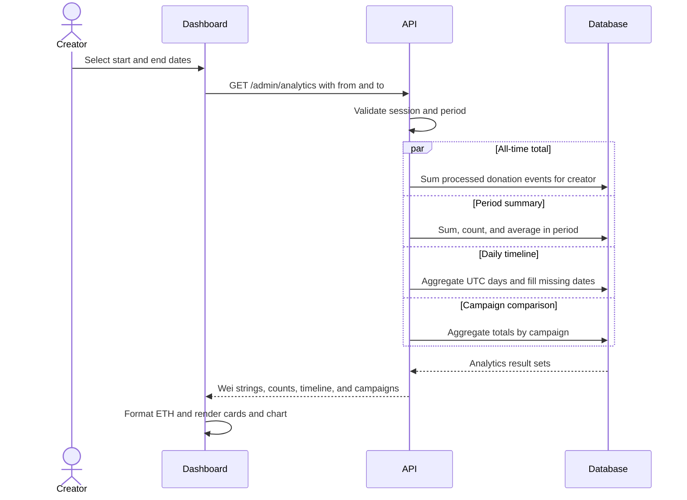

# Analytics flow

The analytics dashboard is an authenticated, off-chain projection of confirmed donation events associated with the creator's campaigns.

## Request flow

## Period rules

- When no period is supplied, the backend uses the preceding 30 days.
- The start must be earlier than the end.
- The maximum interval is 366 days.
- The database treats the interval as `from <= timestamp < to`.
- Daily aggregation uses UTC.

The frontend sends complete ISO timestamps derived from the selected dates so the API receives an unambiguous interval.

## Included donations

Only donation events that:

- Were confirmed and stored by the API or worker.
- Were matched to a published creator campaign.
- Produced a notification for the authenticated creator.
- Have processing status `processed`.

are included in analytics.

This prevents another creator's data from appearing and avoids counting an event that has not yet been associated with a campaign.

## Returned metrics

| Metric | Meaning |
| --- | --- |
| `totalRaisedWei` | All-time gross indexed donations |
| `periodRaisedWei` | Gross donations inside the selected interval |
| `periodDonationCount` | Number of donation events inside the interval |
| `periodAverageDonationWei` | Integer average donation in the interval |
| `timeline` | One row per UTC day, including zero-value days |
| `campaigns` | All-time and period totals grouped by campaign |

Financial values remain decimal wei strings in JSON to avoid JavaScript number precision loss. The frontend converts them to `bigint` before formatting ETH.

## Freshness

The dashboard reflects indexed donations, not an independent scan performed during each request. A donation normally appears immediately through the transaction-hash confirmation route. The donation worker provides eventual recovery when that fast path is unavailable.

Manual refresh issues a new API request for the selected interval.

