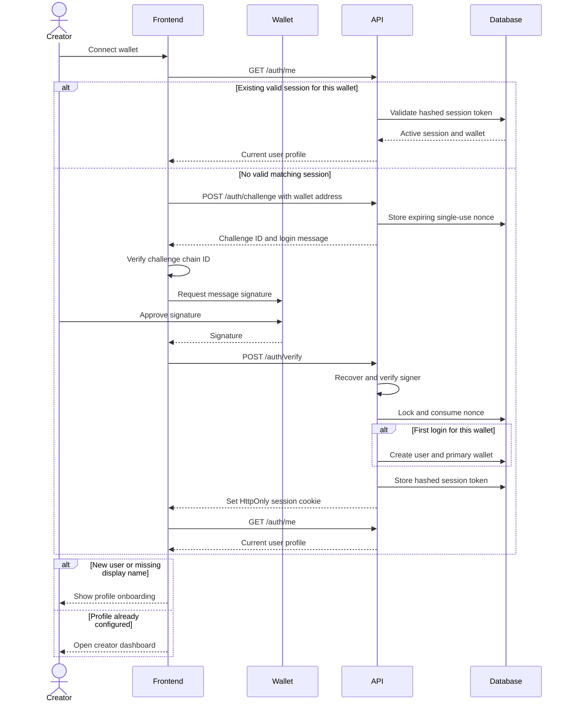

# Wallet authentication flow

CrowdTube authenticates creators by proving ownership of an Ethereum wallet. Signing the login message is free: it is not a blockchain transaction and does not spend gas.

## Sequence

## Challenge message

The backend creates a structured message containing:

- Authentication domain and URI.
- Wallet address.
- Chain ID.
- Random nonce.
- Issue and expiration timestamps.

The frontend checks the chain ID before asking the wallet to sign. The backend reconstructs the expected message rather than trusting message text supplied by the browser.

## Session security

- A nonce is single-use and expires after `AUTH_NONCE_TTL_SECONDS`.
- Verification locks the nonce in a database transaction to prevent concurrent reuse.
- Only a hash of the session token is stored in PostgreSQL.
- The raw token is returned as an HttpOnly cookie.
- Production cookies are marked `Secure`.
- Logout revokes the server-side session and clears the cookie.
- Every `/admin` API route validates the session and resolves its linked wallet.

## User and wallet identity

The user profile is independent from a wallet address. A `user_wallets` row links a verified address to a user. The current MVP creates one primary wallet on first login, while the data model allows multiple linked wallets in the future.

## Common failures

| Failure | Result |
| --- | --- |
| Frontend and backend chain IDs differ | Frontend reports a network mismatch before signing |
| User rejects signature | Authentication remains incomplete |
| Nonce expired | API returns an authentication error; request a new challenge |
| Nonce already used | API rejects replay with a conflict response |
| Signature belongs to another address | API rejects the signature |
| Cookie expired or revoked | Protected API returns `401 UNAUTHENTICATED` |

