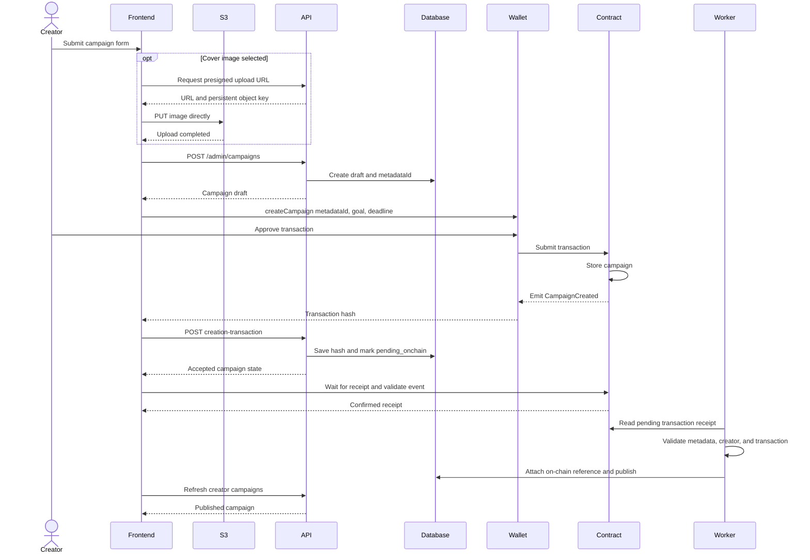

# Campaign creation flow

Campaign creation intentionally spans two systems. Presentation data is stored in PostgreSQL, while ownership, goal, deadline, and financial state are created in the smart contract.

## Sequence

## Recoverable state

The frontend first creates a `draft`. This guarantees that the immutable `metadataId` exists before it is submitted to the contract.

When the wallet returns a transaction hash, the frontend sends it to the backend. The campaign becomes `pending_onchain`, allowing the worker to query that exact receipt instead of waiting to scan every historical block.

If registering the transaction hash fails, the frontend must not ask the creator to send another transaction. The worker can still match a later `CampaignCreated` event by `metadataId` and creator wallet.

## Publication checks

The worker publishes a campaign only when:

- The event belongs to the configured chain and contract.
- The `metadataId` matches an existing draft or pending campaign.
- The event creator belongs to a wallet linked to the draft creator.
- A stored transaction hash, when present, matches the event transaction.
- The on-chain reference does not conflict with another campaign.
- The event has the configured number of confirmations.

After publication, public endpoints expose the campaign and the frontend can read its financial state from the contract.

## Cloning and editing

- **Clone** is a frontend convenience. It reads reusable data, opens the creation modal with those values, and appends ` - Copy` to the title. Saving creates a new draft and a new blockchain campaign.
- **Edit** sends a `PATCH` request for off-chain presentation fields. It never changes the goal, deadline, raised amount, withdrawn amount, creator, or on-chain ID.

