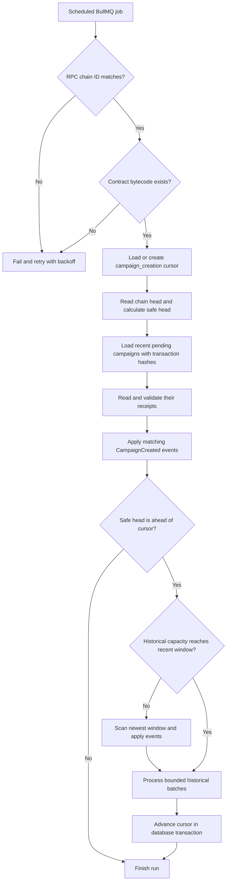

# Campaign indexer flow

The campaign indexer associates `CampaignCreated` events with off-chain drafts. It combines a transaction-receipt fast path, a recent-window priority scan, and bounded historical catch-up.

## One synchronization run



## Durable cursor

The cursor row uses:

```text
chain ID + contract address + stream name campaign_creation
```

Its initial value is `CAMPAIGN_DEPLOY_BLOCK - 1`. Each historical batch reads events and advances the cursor in one PostgreSQL transaction. A row lock prevents concurrent workers from advancing the same cursor from stale data.

Receipt processing and recent-window scans do not advance the historical cursor. Historical catch-up remains the complete reconciliation path.

## Safe head

The indexer processes only blocks with the required confirmation depth:

```text
safe head = current head - (required confirmations - 1)
```

Increasing `CAMPAIGN_CONFIRMATIONS` reduces exposure to short reorganizations but delays publication and donation projection.

## Fast path

Pending campaigns with `creationTransactionHash` are checked directly. Once a successful, sufficiently confirmed receipt contains exactly one matching event, the campaign can be published without waiting for the historical cursor.

## Recent-window priority

If the worker was offline and the historical cursor is far behind, it first scans the newest block window. New campaigns can therefore appear quickly while older blocks are still being recovered.

The extra recent request is skipped when the configured historical work for the same run can already reach or overlap that window.

## Historical catch-up controls

- `CAMPAIGN_LOG_BATCH_SIZE` controls the number of blocks in each `eth_getLogs` request.
- `CAMPAIGN_MAX_HISTORICAL_BATCHES_PER_RUN` bounds work per scheduled run.
- `CAMPAIGN_INDEXER_POLL_MS` controls the recurring job interval.
- BullMQ retries failed runs with backoff.

For restricted RPC plans, reduce the log batch size. Increasing batches per run improves catch-up speed but also increases RPC and database load.

## Event association outcomes

| Outcome | Meaning |
| --- | --- |
| Applied | Draft was safely published |
| Unmatched | No campaign has the event metadata ID yet |
| Creator mismatch | Event wallet is not linked to the draft creator |
| Conflict | Campaign or on-chain reference disagrees with existing state |
| Idempotent | Event was already applied and requires no change |

