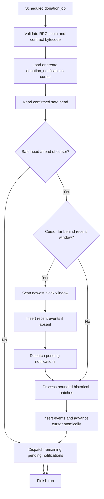

# Donation indexer flow

The donation indexer projects `DonationReceived` logs into PostgreSQL and produces creator notifications. It prioritizes recent events without abandoning complete historical recovery.

## One synchronization run



## Recent-first behavior

When the worker is significantly behind, the recent window is scanned before historical blocks. This allows a new donation and its notification to appear quickly even after a long outage.

Recent scanning does not advance the durable cursor. The historical path later reaches the same blocks and safely encounters already-inserted events.

## Historical reconciliation

For each batch, the worker:

1. Reads logs from `cursor + 1` through a bounded end block.
2. Locks and rechecks the cursor.
3. Inserts new donation events.
4. Advances the cursor in the same database transaction.

One failed transaction therefore cannot advance the cursor without persisting its events.

## Notification dispatch

New donation events begin with `pending` processing status. The dispatcher looks up a campaign by:

```text
chain ID + contract address + on-chain campaign ID
```

If a matching campaign exists, it creates one notification for the campaign creator and marks the event `processed`.

If the campaign has not been published yet, the event remains pending. A later worker run retries it after campaign indexing catches up.

## Idempotency

Two database constraints protect repeated discovery:

- One donation event per chain, contract, transaction hash, and log index.
- One notification per donation event.

The transaction-hash API path and worker can run in any order without duplicating history or notifications.

## Operational tuning

| Setting | Effect |
| --- | --- |
| `CAMPAIGN_LOG_BATCH_SIZE` | Block range per RPC log request |
| `CAMPAIGN_MAX_HISTORICAL_BATCHES_PER_RUN` | Maximum historical work per run |
| `DONATION_NOTIFICATION_POLL_MS` | Time between recurring runs |
| `CAMPAIGN_CONFIRMATIONS` | Confirmation depth used by both indexers |

Monitor RPC rate limits, job failures, cursor lag, pending donation events, and queue health. Small RPC plans may require a batch size as low as the provider's permitted range.

