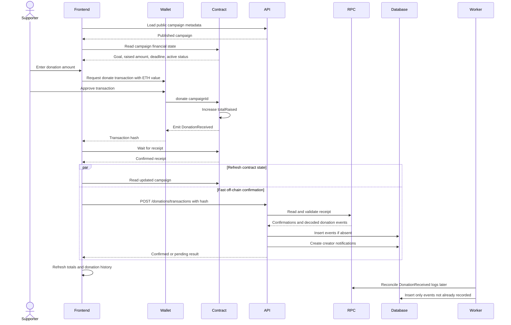

# Donation flow

Supporters donate directly from their wallets to the contract. The backend confirms and indexes the transaction only after the blockchain transfer has already occurred.

## Sequence

## Contract validation

The contract rejects the donation when:

- The campaign does not exist.
- The campaign is paused.
- The deadline has passed.
- The amount is zero.

The frontend also performs early validation for a clearer user experience, but contract checks are authoritative.

## Transaction-hash fast path

After the wallet confirms the transaction, the frontend calls `POST /donations/transactions`.

The backend:

1. Verifies that the RPC is connected to the configured chain.
2. Loads the transaction receipt.
3. Rejects reverted transactions.
4. Checks the required confirmation count.
5. Decodes and validates donation events from the configured contract.
6. Inserts each event idempotently.
7. Immediately attempts to create creator notifications.

The response is `202` while confirmations are still pending and `200` after confirmation.

## Worker fallback

The worker remains necessary even with the fast API route. It recovers donations when:

- The browser closes after sending the transaction.
- The API request fails or times out.
- The receipt initially lacks enough confirmations.
- Another client writes directly to the contract.
- The API or worker was temporarily offline.

## Donation history

Public and creator pages query indexed events from PostgreSQL, ordered by block number and log index descending. The public endpoint exposes only published campaigns; the creator endpoint also verifies ownership.

Sepolia transaction hashes link to the public block explorer. Local transaction hashes remain visible without an external link.

