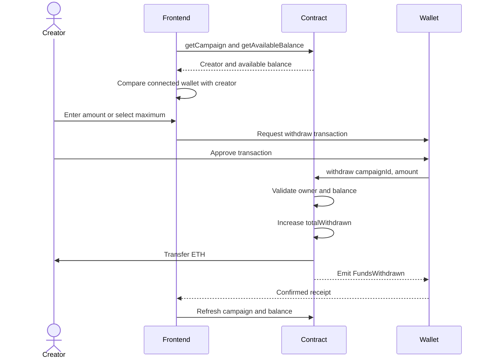
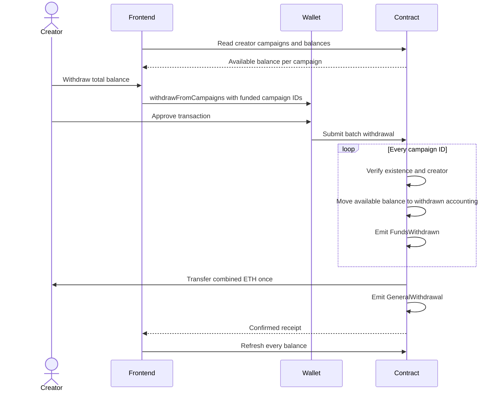

# Withdrawal flow

Withdrawals are direct contract transactions. The backend does not approve, relay, or custody creator funds.

## Single-campaign withdrawal



Available balance is:

```text
totalRaised - totalWithdrawn
```

The contract rejects zero amounts, amounts above the available balance, and callers who are not the campaign creator.

## Consolidated withdrawal

The creator wallet page loads all published campaigns associated with the authenticated creator, verifies their on-chain creator addresses, and reads each available balance.



The entire consolidated transaction reverts if any supplied campaign does not exist or belongs to another wallet. Campaigns with a zero balance are skipped, but the final combined amount must be greater than zero.

## Reentrancy protection

Both withdrawal functions use a contract-wide non-reentrancy lock. Accounting is updated before the external ETH transfer, following the checks-effects-interactions pattern.

## Analytics behavior

Withdrawals do not reduce historical donation totals. Analytics reports gross contributions. The creator wallet reads the current withdrawable amount directly from the contract.

