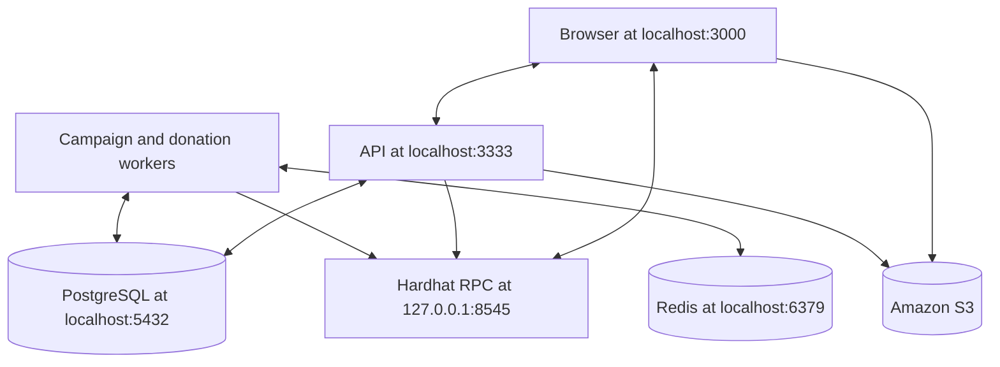

# Getting started

This guide starts the complete CrowdTube stack on a local Hardhat network using compiled, production-style application commands.

For the complete description of every environment variable, its default value, and the values that must agree across modules, see the [Configuration reference](configuration.md).

## Prerequisites

- Node.js 22 LTS and npm.
- Docker Desktop or another Docker Compose-compatible runtime.
- A browser wallet supported by thirdweb, such as MetaMask.
- A thirdweb client ID.
- An Amazon S3 bucket and credentials for profile and campaign images.

The API can start with placeholder AWS values, but media upload and display require a real bucket with valid credentials and browser CORS rules.

## 1. Install dependencies

Each module owns its dependencies and lockfile.

```bash
cd web3
npm ci

cd ../backend
npm ci

cd ../frontend
npm ci
```

## 2. Create environment files

From PowerShell:

```powershell
Copy-Item backend/.env.example backend/.env
Copy-Item frontend/.env.example frontend/.env
```

From a Unix-like shell:

```bash
cp backend/.env.example backend/.env
cp frontend/.env.example frontend/.env
```

Do not commit either `.env` file.

Review [Secret handling](configuration.md#secret-handling) before adding credentials or RPC URLs.

## 3. Start PostgreSQL and Redis

Run from `backend`:

```bash
npm run infra:up
```

This starts:

- PostgreSQL on `localhost:5432` by default.
- Redis on `localhost:6379` by default.

The Docker services read database values from `backend/.env`.

## 4. Start the local blockchain

Open a dedicated terminal and keep it running:

```bash
cd web3
npm run node
```

Hardhat starts an RPC server at `http://127.0.0.1:8545`, using chain ID `31337`. It prints a list of funded development accounts and private keys.

These keys are public test credentials. Use them only on the local chain.

## 5. Deploy the main contract locally

In another terminal:

```bash
cd web3
npm run deploy:campaigns:localhost
```

Copy the deployed `CrowdTubeCampaigns` address from the command output or from:

```text
web3/ignition/deployments/chain-31337/deployed_addresses.json
```

The local deployment directory is intentionally ignored because restarting the Hardhat node creates a new chain.

## 6. Configure the backend

Update these values in `backend/.env`:

```dotenv
FRONTEND_ORIGIN=http://localhost:3000
AUTH_DOMAIN=localhost:3000
AUTH_URI=http://localhost:3000
AUTH_CHAIN_ID=31337

REDIS_URL=redis://localhost:6379
CAMPAIGN_RPC_URL=http://127.0.0.1:8545
CAMPAIGN_CHAIN_ID=31337
CAMPAIGN_CONTRACT_ADDRESS=<LOCAL_CONTRACT_ADDRESS>
CAMPAIGN_DEPLOY_BLOCK=0
CAMPAIGN_CONFIRMATIONS=1
```

`CAMPAIGN_DEPLOY_BLOCK=0` is suitable for a fresh local chain. Public networks should use the actual contract deployment block.

Keep `NODE_ENV=dev` when running this local HTTP environment. The production value `prd` enables a `Secure` session cookie and therefore requires HTTPS. The commands below still build and run the same compiled artifacts used in production.

For media support, also provide valid `AWS_REGION`, `AWS_S3_BUCKET_NAME`, `AWS_ACCESS_KEY_ID`, and `AWS_SECRET_ACCESS_KEY` values.

See [Backend environment](configuration.md#backend-environment) for the full API, authentication, S3, worker, and indexer configuration.

## 7. Run database migrations

From `backend`:

```bash
npm run migration:run
```

TypeORM compiles the project and applies only pending migrations.

## 8. Configure the frontend

Update `frontend/.env`:

```dotenv
NEXT_PUBLIC_THIRDWEB_CLIENT_ID=<YOUR_THIRDWEB_CLIENT_ID>
NEXT_PUBLIC_WEB3_NETWORK=hardhat
NEXT_PUBLIC_CROWDTUBE_CAMPAIGNS_ADDRESS=<LOCAL_CONTRACT_ADDRESS>
NEXT_PUBLIC_API_URL=http://localhost:3333
```

The contract address must be identical in the frontend and backend environments.

See [Frontend environment](configuration.md#frontend-environment) and [Values that must agree](configuration.md#values-that-must-agree) for the complete frontend reference and network consistency rules.

## 9. Start the application processes

Build the modules and keep each runtime process in its own terminal. These commands run compiled artifacts without development file watchers.

API:

```bash
cd backend
npm run build
npm start
```

Workers:

```bash
cd backend
npm run worker:start
```

Frontend:

```bash
cd frontend
npm run build
npm start
```

The complete local topology is now:



## 10. Configure the local network in the wallet

Add a custom network with:

| Field | Value |
| --- | --- |
| Network name | Hardhat Local |
| RPC URL | `http://127.0.0.1:8545` |
| Chain ID | `31337` |
| Currency symbol | `ETH` |

Import one of the funded private keys printed by `npm run node`. Never use this account outside the local network.

## 11. Verify the installation

1. Open <http://localhost:3333/health>. The response should report that the API and database are available.
2. Open <http://localhost:3333/docs> to inspect the API in Swagger UI.
3. Open <http://localhost:3000> and connect the imported local wallet.
4. Sign the authentication message.
5. Complete the creator profile if this is the first login.
6. Create a campaign and wait for the worker to publish it.
7. Open its public page and submit a donation from another local account.

## Common problems

### Network mismatch

Confirm all chain IDs are `31337` and all components use the same contract address. Restarting the Hardhat node invalidates previous local deployments, transactions, and worker cursors.

### The campaign remains pending

- Confirm `npm run worker:start` is running.
- Confirm Redis is available.
- Verify the RPC URL, chain ID, contract address, and deployment block.
- Check that the wallet used to create the campaign is linked to the authenticated creator.

### Donations are confirmed but notifications are missing

- Confirm the donation worker is running.
- Confirm the campaign has already been indexed and published.
- Verify that `CAMPAIGN_CONFIRMATIONS` is not greater than the confirmations currently available.

### Images fail to upload

- Verify the AWS credentials and bucket name.
- Allow browser `PUT` requests from `http://localhost:3000` in the S3 CORS configuration.
- Allow the content types `image/jpeg`, `image/png`, and `image/webp`.

## Stop the environment

Stop the Node.js processes with `Ctrl+C`, then run:

```bash
cd backend
npm run db:down
```

Docker volumes are preserved. Use Docker volume management explicitly if you want to remove local data.

