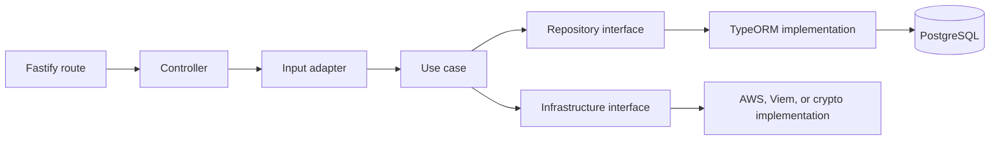

# Project structure

CrowdTube is a monorepository with three independently installable Node.js projects. There is no root `package.json`; commands must be run inside the relevant module.

## Top level

```text
CrowdTube/
├── backend/              API, persistence, workers, and integrations
├── frontend/             Browser application
├── web3/                 Smart contracts and deployments
├── docs/                 Technical documentation
└── README.md              Project entry point
```

## Backend

```text
backend/
├── common/lib/           External infrastructure implementations
│   ├── aws/s3/           S3 client and presigned URL operations
│   ├── bullmq/           Recurring worker bootstrap
│   ├── crypto/           Session token generation and hashing
│   ├── redis/            Redis client factory
│   └── viem/             Wallet verification and blockchain readers
├── config/               Environment parsing and Swagger configuration
├── src/
│   ├── adapters/         HTTP and blockchain input translation
│   ├── controllers/      Framework-facing controller wrapper
│   ├── database/         TypeORM data source, schemas, and migrations
│   ├── entities/         Domain entities and state transitions
│   ├── errors/           Application error model
│   ├── repository/       Repository contracts and TypeORM implementations
│   ├── routes/           Fastify routes and JSON schemas
│   ├── usecases/         Application business rules
│   ├── workers/          Campaign and donation worker processes
│   ├── app.ts            Fastify application composition
│   ├── container.ts      Dependency composition root
│   └── server.ts         API process entry point
├── test/                 Unit, adapter, integration, and route tests
├── compose.yaml          PostgreSQL and Redis development services
├── .env.example          Backend configuration template
└── package.json          Backend commands and dependencies
```

The typical backend dependency direction is:



Business rules belong in `usecases` and `entities`. Fastify-specific request handling belongs in `routes`, `controllers`, and HTTP adapters. Persistence details stay behind repository interfaces.

## Frontend

```text
frontend/
├── src/
│   ├── app/              Next.js App Router pages and layouts
│   │   ├── admin/        Authenticated creator area
│   │   └── campaigns/    Public campaign list and details
│   ├── components/
│   │   ├── analytics/    Analytics dashboard
│   │   ├── auth/         Login and access control
│   │   ├── campaign/     Campaign forms, cards, history, and controls
│   │   ├── layout/       Sidebar, account actions, and language selector
│   │   ├── notification/ Notification center
│   │   ├── profile/      Profile editing and first-login onboarding
│   │   └── wallet/       Wallet connection, authentication, and balances
│   ├── hooks/            Reusable asynchronous state and data hooks
│   ├── i18n/             Language provider and JSON message catalogs
│   ├── lib/
│   │   ├── api/          Typed API client functions
│   │   ├── thirdweb/     Thirdweb client initialization
│   │   └── web3/         Chain, contract, ABI, and value helpers
│   └── types/            Shared frontend types
├── public/               Static browser assets
├── .env.example          Public frontend configuration template
├── next.config.ts        Next.js configuration
└── package.json          Frontend commands and dependencies
```

Pages coordinate route-level state. Reusable UI and Web3 behavior live in components. API calls and contract configuration stay in `lib` so presentation code does not duplicate infrastructure details.

## Web3

```text
web3/
├── contracts/
│   ├── CrowdTubeCampaigns.sol   Main application contract
│   └── DonationVault.sol        Earlier standalone donation example
├── ignition/
│   ├── modules/                 Reproducible deployment modules
│   └── deployments/             Public network deployment records
├── test/                        Contract tests using Hardhat and Viem
├── hardhat.config.ts            Compiler profiles and network definitions
└── package.json                 Build, test, node, and deploy commands
```

`CrowdTubeCampaigns.sol` is the contract used by the frontend and backend. `DonationVault.sol` remains as a smaller standalone contract and learning reference.

## Generated and local-only directories

Do not manually edit or commit these generated paths unless their module documentation explicitly says otherwise:

| Path | Purpose |
| --- | --- |
| `*/node_modules/` | Installed dependencies |
| `backend/dist/` | Compiled backend and tests |
| `frontend/.next/` | Next.js development and build output |
| `web3/artifacts/` | Compiled ABI and bytecode |
| `web3/cache/` | Hardhat compiler cache |
| `web3/ignition/deployments/chain-31337/` | Ephemeral local deployment state |

Sepolia Ignition deployment records may be committed. They describe already-public transactions and contract addresses and allow future deployments to resume safely.

