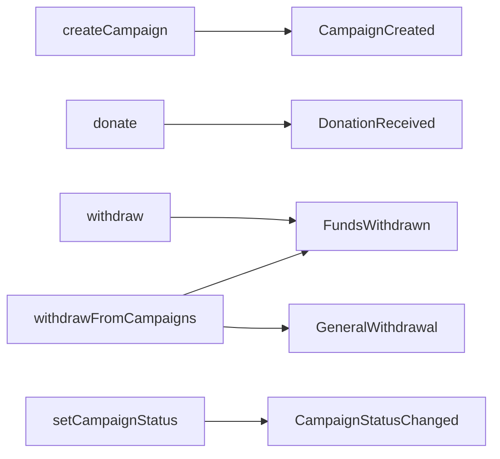

# Smart contracts and Web3

The main application contract is `web3/contracts/CrowdTubeCampaigns.sol`. It owns financial state and emits the events consumed by the backend.

## Contract state

Each on-chain campaign stores:

| Field | Meaning |
| --- | --- |
| `creator` | Wallet allowed to manage status and withdraw |
| `metadataId` | Immutable link to the backend campaign draft |
| `goal` | Campaign goal in wei |
| `deadline` | Unix timestamp, or `0` for no deadline |
| `totalRaised` | Gross amount donated |
| `totalWithdrawn` | Amount already transferred to the creator |
| `active` | Whether new donations are accepted |

The contract computes available balance as `totalRaised - totalWithdrawn`.

## Public operations

| Function | Caller | Purpose |
| --- | --- | --- |
| `createCampaign(metadataId, goal, deadline)` | Any wallet | Create an active campaign |
| `donate(campaignId)` | Any funded wallet | Donate `msg.value` ETH |
| `withdraw(campaignId, amount)` | Campaign creator | Withdraw part of the available balance |
| `withdrawFromCampaigns(campaignIds)` | Campaign creator | Withdraw all available balances from selected campaigns |
| `setCampaignStatus(campaignId, active)` | Campaign creator | Pause or resume donations |
| `getCampaign(campaignId)` | Anyone | Read campaign state |
| `getAvailableBalance(campaignId)` | Anyone | Read withdrawable balance |

The goal is informational: reaching it does not automatically close the campaign. Donations stop only when the creator pauses the campaign or its deadline passes.

## Events



| Event | Backend use |
| --- | --- |
| `CampaignCreated` | Associates the off-chain draft with its on-chain ID |
| `DonationReceived` | Creates history, notification, and analytics projections |
| `FundsWithdrawn` | Currently available for blockchain inspection; balances are read directly |
| `GeneralWithdrawal` | Signals a consolidated withdrawal |
| `CampaignStatusChanged` | Frontend refreshes contract state directly |

## Validation and safety properties

- Campaign metadata IDs cannot be zero.
- Goals must be greater than zero.
- Deadlines must be in the future or zero.
- Donations must be greater than zero and require an active, non-expired campaign.
- Only the recorded creator can change status or withdraw.
- Withdrawals update accounting before the external ETH transfer.
- A contract-wide non-reentrancy lock protects withdrawal functions.
- Consolidated withdrawal verifies ownership of every requested campaign.

These controls do not replace an independent security audit.

## Network configuration

| Network | Chain ID | Purpose |
| --- | --- | --- |
| Hardhat local | `31337` | Development and manual testing |
| Sepolia | `11155111` | Public test deployment |

The selected frontend network, authentication chain, worker chain, RPC endpoint, and contract address must all refer to the same deployment.

## Build and test

From `web3`:

```bash
npm run build
npm test
```

The tests use a temporary Hardhat chain and Viem clients. They cover campaign creation, donation rules, authorization, status changes, single-campaign withdrawal, and consolidated withdrawal.

## Local deployment

Start the persistent node:

```bash
npm run node
```

Deploy in another terminal:

```bash
npm run deploy:campaigns:localhost
```

Local Ignition state is not committed because a restarted Hardhat node has different chain state.

## Sepolia deployment

Provide `SEPOLIA_RPC_URL` and `SEPOLIA_PRIVATE_KEY`, then run:

```bash
npm run deploy:campaigns:sepolia
```

The script uses the optimized production compiler profile. See [Deployment](deployment.md) for the full application rollout.

## Ignition records

For persistent networks, `ignition/deployments` records:

- Contract address.
- Deployment transaction and receipt.
- Compiler build information.
- Execution journal used for safe resume.

These files contain public blockchain information and should not contain private keys. Keeping them in Git is different from committing `.env` or a deployer secret.

## `DonationVault.sol`

`DonationVault` is an earlier standalone learning contract with one owner and one campaign identifier. The production application integration uses `CrowdTubeCampaigns`, which supports multiple campaigns in one deployment.

## Trust and upgrade model

The current contract:

- Has no owner-level administrator.
- Has no upgrade proxy.
- Has no emergency pause for the entire protocol.
- Accepts only native ETH, not ERC-20 tokens.

Changing contract behavior requires a new deployment and coordinated frontend/backend configuration update.

